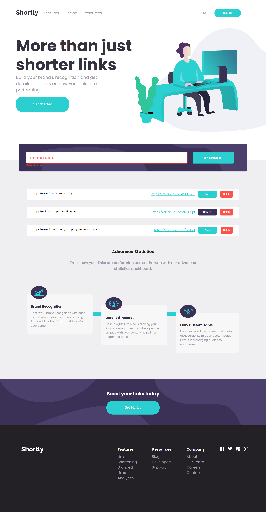

Frontend Mentor - Shortly URL shortening API Challenge solution

This is a solution to the Shortly URL shortening API Challenge
. Frontend Mentor challenges help you improve your coding skills by building realistic projects.

Users should be able to:

View the optimal layout for the site depending on their device's screen size

Shorten any valid URL

See a list of their shortened links, even after refreshing the browser

Copy the shortened link to their clipboard in a single click

Delete a shortened link from the saved list

Receive an error message when the form is submitted if the input field is empty or the URL is invalid

Screenshot

Links

Solution URL: https://github.com/Fabiha517/URL-shortening-API-landing-page.git

Live Site URL: https://fabiha517.github.io/URL-shortening-API-landing-page/

My process
Built with

Semantic HTML5 markup

CSS custom properties

Flexbox

CSS Grid

Mobile-first workflow

Vanilla JavaScript (no framework)

Local Storage (to persist shortened URLs)

What I learned

Working on this project helped me understand how to:

Validate user input URLs using the URL constructor in JavaScript

Use fetch() with a POST request to connect to an external API (cleanuri.com)

Store and restore data using localStorage

Implement copy-to-clipboard functionality with navigator.clipboard

Add a delete feature to remove specific entries from both UI and storage

Continued development

In the future, I’d like to:

Improve error handling for different API failures

Add a feature to track how many times a shortened link is copied or clicked

Implement a more polished UI with animations and better mobile interactions

Explore integrating another URL-shortening API with analytics support

Author

Frontend Mentor – @Fabiha517

